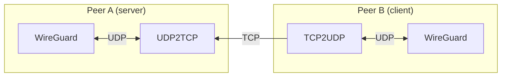

# WireGuard TCP tunneling

## About

This project is a simple UDP-over-TCP tunneling. The main purpose of it is to
allow [WireGuard](https://www.wireguard.com/) to work over TCP.



## Installation

### Dependencies

This project is based on [Boost.Asio](https://www.boost.org/), so in order to
build it you need to have Boost installed. Also, you need to have CMake and a
C++ compiler that supports C++17.

On Debian-based systems all dependencies can be installed by running:

```sh
sudo apt install \
  libboost-dev libboost-log-dev libboost-program-options-dev \
  cmake g++
```

### Building

```sh
cmake -S . -B build \
  -DCMAKE_BUILD_TYPE=Release \
  -DENABLE_SYSTEMD=ON \
  -DENABLE_NGROK=ON
cmake --build build
sudo cmake --install build
```

## Usage

### Server Side

On the server side (the side that has a public IP address) you can run the
`wg-tcp-tunnel` as follows:

```sh
wg-tcp-tunnel --src-tcp=0.0.0.0:51820 --dst-udp=127.0.0.1:51820
```

This will tell the `wg-tcp-tunnel` to listen on all interfaces on port 51820
for TCP connections and forward them to the local WireGuard instance. This
repository contains a [systemd](https://systemd.io/) service file that can be
used to run the `wg-tcp-tunnel` as a service. By default, that service will
do exactly the same as the command above.

### Client Side

On the client side one can run the `wg-tcp-tunnel` as follows:

```sh
wg-tcp-tunnel --src-udp=127.0.0.1:51822 --dst-tcp=<SERVER-IP>:51820
```

This will tell the `wg-tcp-tunnel` to listen on the loopback interface on port
51822 for UDP connections and forward them to the server's public IP address
over TCP. Then in the WireGuard configuration file one needs to specify the
peer's endpoint address as `Endpoint = 127.0.0.1:51822`. Simple as that.

When configured with `-DENABLE_NGROK=ON`, the `wg-tcp-tunnel` also provides
support for getting NGROK endpoint and using it as a destination address. In
order to use this feature, one needs to specify the `--ngrok-api-key=KEY` and
`--ngrok-dst-tcp-endpoint=ENDPOINT` options. For more information about these
options, please refer to the `--help` output.

## License

This project is licensed under the MIT license. See the [LICENSE](LICENSE) file
for details.
